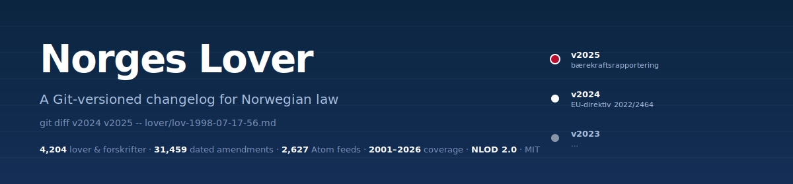
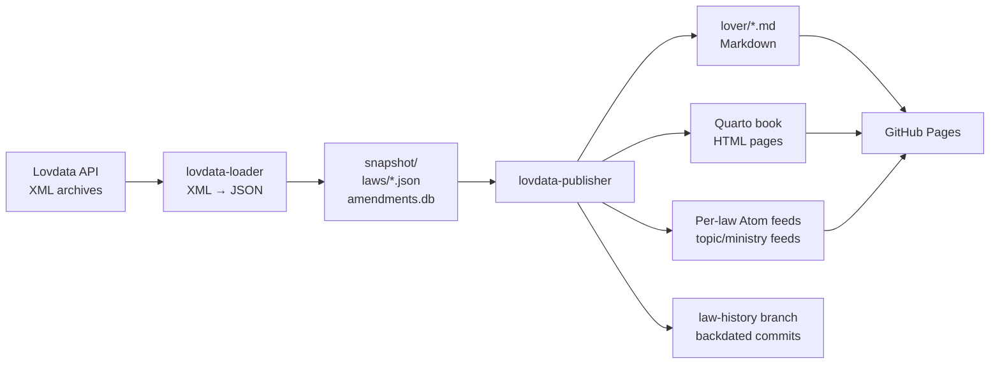

<p align="center">
  
</p>

**A Git-versioned changelog for Norwegian law.** Every amendment to every law and every central regulation, parsed, diffable, and subscribable — so you can track regulatory changes the way developers track code changes.

**[Browse the site →](https://sondreskarsten.github.io/norwegian-laws/)** · **[Atom feeds →](https://sondreskarsten.github.io/norwegian-laws/feeds/)** · **[Law history →](https://github.com/sondreskarsten/norwegian-laws/tree/law-history)**

<p>
  <a href="https://github.com/sondreskarsten/norwegian-laws/actions/workflows/deploy.yml"></a>
  <a href="https://github.com/sondreskarsten/norwegian-laws/commits/main"></a>
  
  
  
  <a href="LICENSE"></a>
  
</p>

```diff
# Amendment to regnskapsloven from LOV-2024-06-21-42 (bærekraftsrapportering)
# New § 1-2a added; Chapter 2 "Årsberetning" retitled to include sustainability reporting

  #### § 1-2. Regnskapspliktige
+ #### § 1-2a. Regnskapspliktige med plikt til å utarbeide bærekraftsrapportering
+ 
+ (1) Bestemmelsene i §§ 2-3 til 2-8 gjelder for følgende regnskapspliktige:
+ - 1. store foretak…
+ - 2. små og mellomstore foretak som er noterte foretak…
  
- ## Kapittel 2 Årsberetning
+ ## Kapittel 2 Årsberetning og bærekraftsrapportering
```

That diff is real, reachable via `git log -p -- lover/lov-1998-07-17-56.md` once you've cloned the [`law-history`](https://github.com/sondreskarsten/norwegian-laws/tree/law-history) branch. Every legislative change since 2001 is a backdated git commit with the commit date matching the actual ikrafttredelse from Norsk Lovtidend.

## Recent amendments

The most recently published lover and forskrifter from Norsk Lovtidend, auto-updated weekly:

<!-- RECENT_AMENDMENTS_START -->
**Lover (endringslover):**

| Date | Amendment | Targets |
|---|---|---|
| 2026-05-12 | Endringslov til straffegjennomføringsloven mv. | [`lov/1980-06-13-35`](https://sondreskarsten.github.io/norwegian-laws/lover/lov-1980-06-13-35.html) [`lov/2001-05-18-21`](https://sondreskarsten.github.io/norwegian-laws/lover/lov-2001-05-18-21.html) [`lov/2011-06-24-30`](https://sondreskarsten.github.io/norwegian-laws/lover/lov-2011-06-24-30.html) |
| 2026-05-07 | Endringslov til lov om supplerande stønad ved kort butid | [`lov/2005-04-29-21`](https://sondreskarsten.github.io/norwegian-laws/lover/lov-2005-04-29-21.html) |
| 2026-05-07 | Endringslov til foretakspensjonsloven og forsikringsvirksomhetsloven | [`lov/2000-03-24-16`](https://sondreskarsten.github.io/norwegian-laws/lover/lov-2000-03-24-16.html) [`lov/2005-06-10-44`](https://sondreskarsten.github.io/norwegian-laws/lover/lov-2005-06-10-44.html) |
| 2026-05-07 | Endringslov til domstolloven mv. | [`lov/1915-08-13-5`](https://sondreskarsten.github.io/norwegian-laws/lover/lov-1915-08-13-5.html) [`lov/1959-12-18-1`](https://sondreskarsten.github.io/norwegian-laws/lover/lov-1959-12-18-1.html) [`lov/1981-05-22-25`](https://sondreskarsten.github.io/norwegian-laws/lover/lov-1981-05-22-25.html) … |
| 2026-04-10 | Endringslov til sikkerhetsloven | [`lov/2018-06-01-24`](https://sondreskarsten.github.io/norwegian-laws/lover/lov-2018-06-01-24.html) |

**Forskrifter:**

| Date | Amendment | Targets |
|---|---|---|
| 2026-05-19 | Endr. i høstingsforskriften | [`forskrift/2021-12-23-3910`](https://sondreskarsten.github.io/norwegian-laws/forskrifter/forskrift-2021-12-23-3910.html) |
| 2026-05-19 | Forskrift om endring i forskrift om lagring og bruk av gjødsel mv. | [`forskrift/2025-01-29-115`](https://sondreskarsten.github.io/norwegian-laws/forskrifter/forskrift-2025-01-29-115.html) |
| 2026-05-19 | Forskrift om endring i forskrift om regulering av fisket etter reke… | [`forskrift/2025-06-27-1361`](https://sondreskarsten.github.io/norwegian-laws/forskrifter/forskrift-2025-06-27-1361.html) |
| 2026-05-18 | Sjøfartskortforskriften | [`forskrift/2011-12-22-1523`](https://sondreskarsten.github.io/norwegian-laws/forskrifter/forskrift-2011-12-22-1523.html) [`forskrift/1988-11-25-940`](https://sondreskarsten.github.io/norwegian-laws/forskrifter/forskrift-1988-11-25-940.html) |
| 2026-05-18 | Endr. i utlendingsforskriften | [`forskrift/2009-10-15-1286`](https://sondreskarsten.github.io/norwegian-laws/forskrifter/forskrift-2009-10-15-1286.html) |
<!-- RECENT_AMENDMENTS_END -->

---

## Who this is for

- **Tax advisors and auditors** — get notified when skatteloven, regnskapsloven, or revisorloven changes, before clients ask
- **Compliance teams** (banks, fintech, AS/ASA) — watch finansforetaksloven, aksjeloven, hvitvaskingsloven for amendments that hit your control framework
- **Treasurers and CFOs** — track ikrafttredelser for laws affecting reporting obligations
- **Legal departments** — `git diff` the law instead of comparing two PDFs side-by-side
- **Fiscal journalists and researchers** — reconstruct the state of any Norwegian law at any historical date with one `git checkout`
- **Anyone building software that depends on Norwegian regulations** — consume changes as Atom feeds or webhooks instead of polling Lovdata

---

## What you can do

### 1. Subscribe to changes in any specific law

Every law has its own Atom feed. Drop the URL into any RSS reader, Slack webhook, or GitHub Action:

```
https://sondreskarsten.github.io/norwegian-laws/feeds/lov-1998-07-17-56.xml   # Regnskapsloven
https://sondreskarsten.github.io/norwegian-laws/feeds/lov-1997-06-13-44.xml   # Aksjeloven
https://sondreskarsten.github.io/norwegian-laws/feeds/lov-2005-06-17-62.xml   # Arbeidsmiljøloven
https://sondreskarsten.github.io/norwegian-laws/feeds/lov-1984-06-08-58.xml   # Konkursloven
```

Or subscribe to entire regulatory areas:

```
https://sondreskarsten.github.io/norwegian-laws/feeds/topic-skatte--og-avgiftsrett.xml
https://sondreskarsten.github.io/norwegian-laws/feeds/topic-bank-finans-og-regnskapsrett.xml
https://sondreskarsten.github.io/norwegian-laws/feeds/topic-arbeidsrett.xml
https://sondreskarsten.github.io/norwegian-laws/feeds/dept-finansdepartementet.xml
```

[Browse all feeds →](https://sondreskarsten.github.io/norwegian-laws/feeds/) · [Interactive subscribe →](https://sondreskarsten.github.io/norwegian-laws/book/abonner.html) · [How to subscribe →](SUBSCRIBE.md) · [Bulk JSONL →](https://sondreskarsten.github.io/norwegian-laws/amendments.jsonl.gz) · [Python example →](examples/python-consumer/)

### 2. Trigger automation when the law changes

The easiest path: copy the [reusable GitHub Action template](examples/github-action-watcher/) and edit the `feeds:` list. It polls the Atom feeds every weekday, opens a GitHub Issue when amendments are detected (with affected paragraphs broken out), and persists state so it never refires.

Or watch the underlying Markdown file directly from your own repo:

```yaml
on:
  push:
    paths:
      - 'lover/lov-1998-07-17-56.md'   # Regnskapsloven
      - 'lover/lov-2005-06-17-62.md'   # Arbeidsmiljøloven

jobs:
  notify:
    runs-on: ubuntu-latest
    steps:
      - uses: actions/checkout@v4
      - name: Post diff to Slack
        run: git diff HEAD~1 HEAD -- lover/*.md | slack-cli post #compliance
```

### 3. Reconstruct the law at any point in history

```bash
git clone -b law-history https://github.com/sondreskarsten/norwegian-laws.git
cd norwegian-laws

# What did regnskapsloven look like on 1 January 2020?
git checkout v2020
cat lover/lov-1998-07-17-56.md

# What's changed since then?
git diff v2020 main -- lover/lov-1998-07-17-56.md
```

### 4. Search 4,200+ laws and regulations

Full-text search with common abbreviations: type `aml` to find arbeidsmiljøloven, `rskl` for regnskapsloven, `pbl` for plan- og bygningsloven.

[Search →](https://sondreskarsten.github.io/norwegian-laws/book/sok.html)

### 5. Compare any two versions side-by-side

Pick a law, pick two versions, see exactly what changed. Word-level diff in the browser.

[Diff tool →](https://sondreskarsten.github.io/norwegian-laws/book/diff.html)

---

## Features

| | |
|---|---|
| 📜 **Complete coverage** | All 783 formal laws + 3,421 central regulations |
| 🔔 **Per-law Atom feeds** | 2,627 subscribable feeds — one per law/forskrift with amendments, plus 35 rettsområde and 16 ministry feeds |
| 🕰️ **Backdated git history** | 38,675 amendment acts as backdated commits, with commit date = ikrafttredelse |
| 📑 **Endringshistorikk per paragraf** | Per-law amendment timeline ([example](https://sondreskarsten.github.io/norwegian-laws/historie/regnskapsloven.html)) plus 13,700+ per-paragraph history pages ([example: § 7-25](https://sondreskarsten.github.io/norwegian-laws/historikk/lov-1998-07-17-56/para-7-25.html)) |
| 🔍 **Full-text search** | Searches title, body, refid, and common abbreviations (`aml`, `pbl`, `rskl`) |
| 📊 **Cross-version diff** | Browser-based diff between any two yearly snapshots (`v2001`–`v2027`) |
| 🤝 **Machine-readable** | Markdown + YAML frontmatter, plus [`laws.json`](https://sondreskarsten.github.io/norwegian-laws/laws.json) for programmatic access |
| 🆓 **Open data + open code** | NLOD 2.0 (Lovdata data) · MIT (code) |
| 🔄 **Updated weekly** | Automated pull from Lovdata API every Sunday |

---

## How it works



Two Python packages connected by a snapshot directory: `lovdata-loader` downloads and parses Lovdata's XML; `lovdata-publisher` formats Markdown, generates Quarto chapters, builds Atom feeds, and writes the backdated git history via `git fast-import`.

GitHub Actions runs the pipeline weekly and deploys to GitHub Pages.

---

## File format

Each law is a Markdown file with YAML frontmatter:

```yaml
---
tittel: "Lov om årsregnskap m.v. (regnskapsloven)"
korttittel: "Regnskapsloven – rskl"
refid: "lov/1998-07-17-56"
eli: "/eli/lov/1998/07/17/56"
departement: "Finansdepartementet"
rettsomrade: "Bank, finans og regnskapsrett>Regnskap"
ikrafttredelse: "1999-01-01"
sist-endret: "lov/2025-06-20-106"
sist-endret-ikrafttredelse: "2026-01-01"
---
```

The body preserves Lovdata's full structure: del, kapittel, paragraph, ledd, list items, and amendment footnotes. Cross-references between laws (`§ 1-2 første ledd`) become clickable links in the rendered HTML.

For programmatic discovery, [`laws.json`](https://sondreskarsten.github.io/norwegian-laws/laws.json) lists all 4,204 documents with metadata, common abbreviations, ELI URIs, feed paths, and per-law `amendments` counts (so you can sort by how active a law is when picking what to monitor).

---

## Quick start (for developers)

```bash
pip install -e lovdata-loader/ -e lovdata-publisher/

# Download archives, parse to snapshot
lovdata-load --download --output snapshot

# Format to Markdown + generate Quarto book chapters + Atom feeds
lovdata-publish --snapshot snapshot --output . --quarto
lovdata-publish --post-render --output . --site-dir _site
```

The `law-history` branch uses git-LFS. Install `git-lfs` before cloning that branch:

```bash
sudo apt-get install -y git-lfs
git lfs install
git clone -b law-history https://github.com/sondreskarsten/norwegian-laws.git
```

---

## Disclaimer

**This is not legal advice and not an authoritative source.** For binding legal text, always use [lovdata.no](https://lovdata.no). The pipeline parses Lovdata's open data with best-effort accuracy and a test suite covering 56 cases, but cannot guarantee zero discrepancies from the official text.

This is an unofficial project, not affiliated with Lovdata or the Norwegian government.

---

## License

- **Law data**: [Norwegian Licence for Open Government Data (NLOD) 2.0](https://data.norge.no/nlod/no/2.0) — Lovdata
- **Source code**: [MIT](LICENSE)
